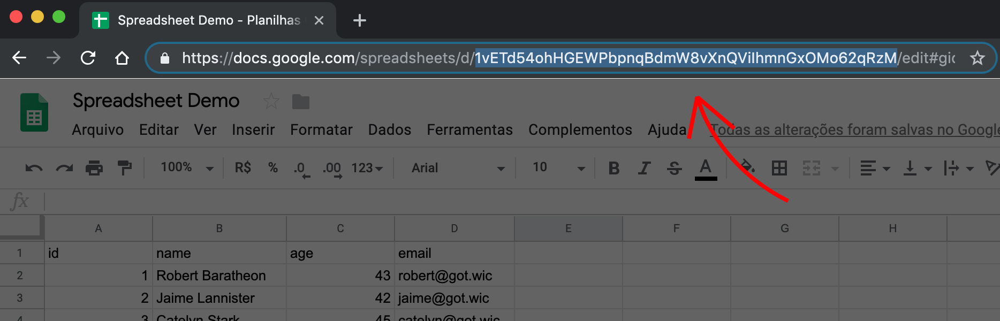

# Google Spreadsheet to JSON
> **WARNING**: This is a experimental package and I really don't recommend to use it in production.

This package is a ES6 module that helps you to fetch and process data from public google spreadsheet.

# Notes
1. Although improbable, it is possible that the way the google API returns data is changed and, therefore, this package will broke.
2. This package uses [Fetch API](https://developer.mozilla.org/en-US/docs/Web/API/Fetch_API) and doesn't support legacy browsers without a polyfill.

# Usage

## Publish your spreadsheet
First, you must publish your spreadsheet to the web, using File -> Publish To Web in your Google Spreadsheet.

## Getting spreadsheetId
You'll find your spreadsheetId in your spreadsheet URL



In the screenshot above the spreadsheet URL is
```
https://docs.google.com/spreadsheets/d/1vETd54ohHGEWPbpnqBdmW8vXnQViIhmnGxOMo62qRzM/edit#gid=0
```

and the spreadsheetId is `1vETd54ohHGEWPbpnqBdmW8vXnQViIhmnGxOMo62qRzM`

## Install package
npm
```shell
npm install gsheet-to-json --save
```

yarn
```shell
yarn add gsheet-to-json
```

## Import and use package
```js
import gsheetToJson from 'gsheet-to-json'

// gsheetToJson returns a Promise and can be used with async/await or with then/catch callbacks
const getGotCharacters = async function  () {
  const gotCharacters = await gsheetToJson({
    id: '1vETd54ohHGEWPbpnqBdmW8vXnQViIhmnGxOMo62qRzM'
  })

  console.log(gotCharacters)
}

getGotCharacters()
```

The result of `gotCharacters` is:
```json
{
  "columns": {
    "id": [
      1,
      2,
      3
    ],
    "name": [
      "Robert Baratheon",
      "Jaime Lannister",
      "Catelyn Stark"
    ],
    "age": [
      38,
      20,
      35
    ],
    "email": [
      "robert@got.wic",
      "jaime@got.wic",
      "catelyn@got.wic"
    ]
  },
  "rows": [
    {
      "id": 1,
      "name": "Robert Baratheon",
      "age": 38,
      "email": "robert@got.wic"
    },
    {
      "id": 2,
      "name": "Jaime Lannister",
      "age": 20,
      "email": "jaime@got.wic"
    },
    {
      "id": 3,
      "name": "Catelyn Stark",
      "age": 35,
      "email": "catelyn@got.wic"
    }
  ]
}
```

## Params

|   Param  | Options            | Default | Description                                                                                                                                                    |
|:--------:|--------------------|---------|----------------------------------------------------------------------------------------------------------------------------------------------------------------|
| id       | string - required  | none    | The ID of your document. This is the big long aplha-numeric code in the middle of your document URL                                                            |
| sheet    | number - optional  | 1       | The number of the individual sheet you want to get data from. Your first sheet is 1, your second sheet is 2, etc. If no sheet is entered then 1 is the default |
| query    | string - optional  | none    | A simple query string. This is case insensitive and will add any row containing the string in any cell to the filtered result.                                 |
| integers | boolean - optional | true    | Setting 'integers' to false will return numbers as a string                                                                                                    |
| rows     | boolean - optional | true    | Setting 'rows' to false will return only column data.                                                                                                          |
| columns  | boolean - optional | true    | Setting 'columns' to false will return only row data                                                           

# Credits
This project was completely inspired and based on [gsx2json](https://github.com/55sketch/gsx2json) by [Nick Moreton](https://github.com/55sketch)
